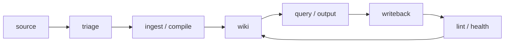

# template-kb

Markdown-first personal AI knowledge base template для Codex, Claude и Cursor.

[](LICENSE)
[](https://github.com/MakenYutvi/template-kb/generate)
[](README.md)

`template-kb` помогает вести личную или рабочую базу знаний так, чтобы AI-агент
мог безопасно восстановить контекст, отделить источники от выводов и продолжить
работу между сессиями.

Идея близка к паттерну [LLM Wiki](https://gist.github.com/karpathy/442a6bf555914893e9891c11519de94f):
сырье хранится в `raw/`, устойчивые выводы - в `wiki/`, а правила работы агента
живут в `AGENTS.md` и `.ai/contract.md`.

## Какую проблему решает

Обычная папка с заметками быстро ломается, когда с ней начинает работать AI:

- важный контекст остается в чатах и теряется;
- source-файлы, summaries и решения смешиваются;
- не видно, какие источники агент реально читал;
- транскрипты и внешние документы могут содержать prompt injection;
- сложно обновить старую KB по новому template без перезаписи своих наработок.

`template-kb` задает операционную модель, в которой у каждого слоя памяти есть
своя роль.



## Что вы получаете

| Возможность | Почему это ценно |
|---|---|
| `raw/` как source of truth | Исходники не переписываются ради красивого summary. |
| `wiki/` как synthesis layer | Агент быстро читает текущее состояние без полного перебора source. |
| `wiki/outputs/` | Длинные research briefs и сравнения не теряются в чате до writeback. |
| `wiki/health/` | Есть место для dated lint/health reports и ручной проверки качества базы. |
| `prompts/apply-template-upgrade.md` | Существующие KB обновляются merge-first, без wholesale overwrite. |
| `AGENTS.md` и `.ai/contract.md` | Codex, Claude и Cursor получают одинаковые правила работы с памятью. |
| `scripts/` | Локальные проверки, item generator, source digests и OS script pruning. |

## Быстрый старт

### Новая KB

1. Создайте private repository из
   [`MakenYutvi/template-kb`](https://github.com/MakenYutvi/template-kb/generate).
2. Откройте репозиторий в Codex, Claude Code, Cursor или другом coding agent.
3. Откройте [`SETUP.md`](SETUP.md) и выполните checklist.
4. Добавьте первый безопасный source-файл в `raw/personal/inbox/`.
5. Запустите lint перед первым commit.

### Обновление существующей KB

Скопируйте
[`prompts/apply-template-upgrade.md`](https://github.com/MakenYutvi/template-kb/blob/main/prompts/apply-template-upgrade.md).
Вставьте этот промпт в агента, запущенного внутри вашей существующей KB. Лучше
запускать его в режиме планирования: сначала получить merge plan и список
затронутых файлов, затем разрешить применение изменений.

Промпт версионируется внутри файла. При upgrade агент должен указать версию
prompt и template commit/tag, если он доступен.

### Локальные проверки

В шаблоне есть несколько helpers для проверки и ведения KB. На Windows доступны
`.cmd` wrappers; на macOS/Linux используйте `python3 scripts/<name>.py`.

Чаще всего нужны три команды:

```powershell
.\scripts\kb_doctor.cmd
.\scripts\wiki_lint.cmd
.\scripts\new_kb_item.cmd source-note "First note" --scope personal
```

- `kb_doctor` проверяет setup репозитория.
- `wiki_lint` проверяет Markdown-ссылки, индексы, naming и базовые правила wiki.
- `new_kb_item` создает заготовки source notes, outputs, health reports, meetings и decisions.

Дополнительные helpers: `install_pre_commit`, `source_digest`,
`prune_os_scripts`. Подробные команды и macOS/Linux варианты есть в
[`SETUP.md`](SETUP.md).

## Почему это надежнее обычной папки с заметками

- Source provenance встроен в workflow: агент должен понимать, где источник, где
  вывод, а где durable writeback.
- Prompt injection считается частью недоверенного source, а не инструкцией для
  агента.
- Substantial outputs сохраняются отдельно от durable wiki, поэтому их можно
  проверить перед переносом в постоянную память.
- Health/lint слой делает состояние базы видимым: broken links, слабые связи,
  naming drift, source digest drift и manual review findings.
- Upgrade существующих KB делается через versioned prompt и аккуратный diff.

## Для кого

- AI power users, которые регулярно работают с Codex, Claude Code, Cursor или
  похожими coding agents.
- Люди, которым нужна private Markdown KB с Git history и проверяемым контекстом.
- Команды и участники хакатонов, которым нужен переносимый стартовый шаблон для
  agent memory.

## Для чего не подходит

- Для хранения plaintext secrets, приватных ключей, seed phrases и токенов.
- Для публичной публикации личных или рабочих источников без redaction.
- Для замены полноценного DMS, CRM, task tracker или корпоративного wiki.
- Для Obsidian-only vault, завязанного на плагины и непереносимый синтаксис.

## Структура

| Путь | Роль |
|---|---|
| `raw/` | Source of truth: заметки, документы, meeting transcripts, assets. |
| `wiki/` | Синтезированная память, решения, workflows, текущий статус. |
| `wiki/outputs/` | Существенные generated outputs до durable writeback. |
| `wiki/health/` | Dated health/lint reports и manual review. |
| `indexes/` | Навигационные карты и связи. |
| `prompts/` | Tool-neutral prompts, включая versioned upgrade prompt. |
| `.ai/` | Общий контракт агентов и privacy rules. |
| `scripts/` | Локальные проверки и helper automation. |

## Демо

Посмотрите безопасный end-to-end сценарий:
[`docs/demo-walkthrough.md`](docs/demo-walkthrough.md).

Он показывает путь `source note -> output -> writeback -> lint/health` без
личного или рабочего контента.

## Безопасность и лицензия

- Правила приватности и prompt-injection handling описаны в
  [`SECURITY.md`](SECURITY.md), [`AGENTS.md`](AGENTS.md) и
  [`.ai/privacy.md`](.ai/privacy.md).
- Roadmap проекта: [`ROADMAP.md`](ROADMAP.md).
- License: [`MIT`](LICENSE).

Если репозиторий содержит личные или рабочие данные, держите его приватным.
